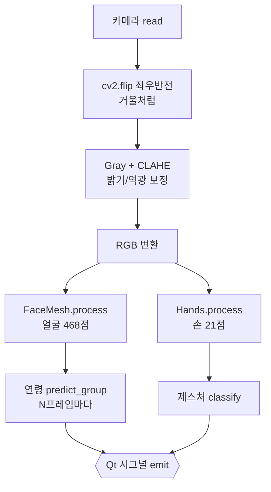
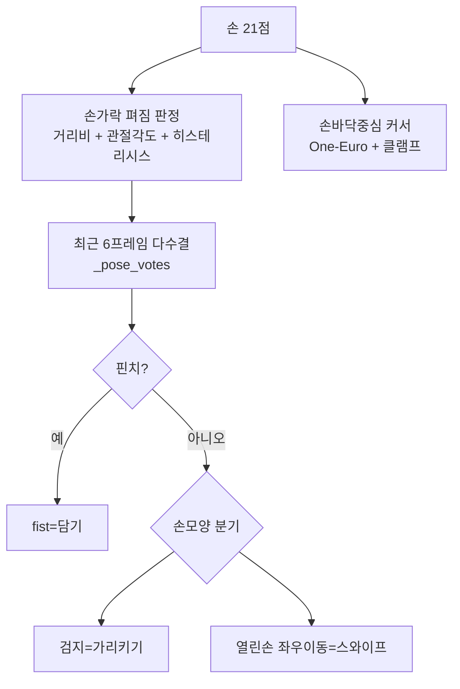
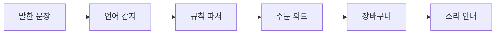
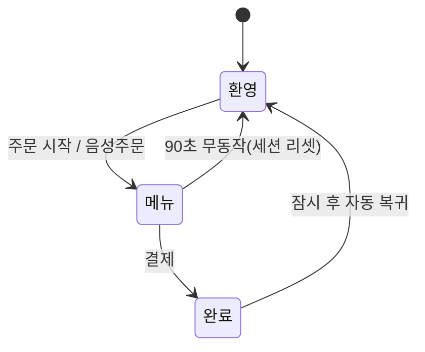
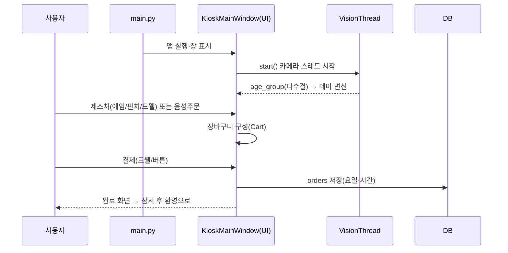
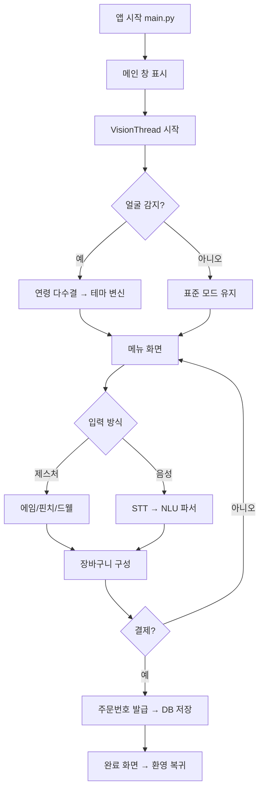
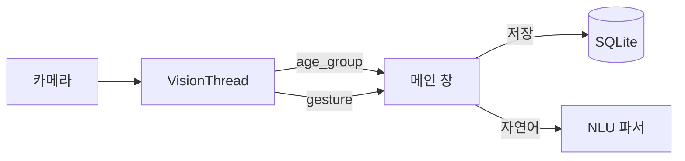

# 🍔 유니버셜 키오스크 — 결선 대비 학습 교재

> **팀명:** NO PROBLEM KIOSK · **작품:** 유니버셜 키오스크 (V2) · **시뮬레이션 매장:** 햄버거 가게
> **대상:** 결선 구술 심사를 준비하는 팀원 3명
> **목표:** 알고리즘 · 기술 스택 · 프로그램 흐름을 **스스로 설명**할 수 있게 만든다.

---

## 📖 이 교재 사용법

- **팀원 3명 전원이 모든 장을 숙지합니다.** 역할을 나누지 않습니다 — 심사위원은 누구에게든 어떤 기술이든 물을 수 있습니다.
- 각 장 끝의 **❓이렇게 물으면** 으로 서로 **모의 문답**을 합니다(한 명이 묻고 두 명이 답).
- 각 장의 **🔗 더 알아보기** 링크로 개념의 원리를 한 단계 더 깊이 확인할 수 있습니다(발표 자신감↑).
- 이 교재는 **기술적인 측면(알고리즘·수식·자료구조·흐름)** 에 집중합니다.
- 마지막 **15장 퀴즈 30문제** 로 각자 풀고 교차 채점하세요.

각 개념은 아래 **4단 서식**으로 설명합니다.

> 🎯 **핵심 한 줄** — 한 문장 요약
> 🍬 **쉬운 비유** — 일상 언어로
> 📐 **정확히** — 정의 · 수식 · **코드 위치**(파일/함수)
> ❓ **이렇게 물으면** — 심사위원 예상 질문 & 모범답변

---

## 0장. 프로젝트 한눈에

### 0.1 무슨 문제를 푸는가 (문제의식)
키오스크가 늘어나면서 **고령층·장애인·어린이·외국인** 이 주문에 어려움을 겪습니다.
유니버셜 키오스크는 **하드웨어를 바꾸지 않고 카메라 + AI 소프트웨어만으로** 사용자의 특성을
알아채어 화면이 **스스로 변신**하는 "따뜻한 AI" 키오스크입니다. (배리어프리 = 장벽 없는 설계)

### 0.2 5대 핵심 기능 (대회 2주 전, 가장 안정적인 기능만 남겨 정리)
| # | 기능 | 한 줄 설명 | 관련 코드 |
|---|------|-----------|-----------|
| 1 | **비접촉 제스처** | 손바닥 커서(에임) → 집기(핀치)·2초 멈추기(드웰)로 선택, 스와이프로 카테고리 넘기기 | `core/vision.py`, `ui/main_window.py` |
| 2 | **나이 인식 자동 화면 전환** | CNN이 얼굴로 연령대(어린이/성인/노인)를 분류 → 다수결로 화면 자동 변신 | `core/age_model.py`, `ui/theme.py` |
| 3 | **음성 기능(시각장애인·저시력자)** | "눈이 불편하신가요?"를 소리로 묻고 '네'면 고대비+음성 주문, 담은 메뉴·합계를 소리로 안내 | `core/speech.py`, `ui/voice_dialog.py`, `core/nlu.py` |
| 4 | **다국어** | 한·영·중 화면 전환, 말한 언어로 자동 전환(주문 분석도 3개 언어) | `core/i18n.py`, `core/nlu.py` |
| 5 | **고대비 화면** | 헤더 👁 버튼으로 검정 배경+노랑·흰 글씨(1.35배) | `ui/theme.py`, `ui/main_window.py _toggle_contrast` |

> 🗑 **정리(삭제)한 기능:** ① 얼굴로 **단골 인식**(오인식·개인정보 위험, 7장) ② **GPT(LLM)** 온라인 분석(인터넷·응답 지연으로 화면 멈춤 위험)
> ③ **엄지척=결제**(엄지 인식이 흔들려 실수 결제 위험). → "많이 넣기보다 **정확하고 안전하게**"가 이번 정리의 원칙.

### 0.3 엘리베이터 피치 (외워둘 것)
- **30초용:** "유니버셜 키오스크는 카메라와 AI만으로 **손님의 연령대** 를 알아보고 화면을 자동으로 바꿔 주며,
  **손짓·말** 로도 주문할 수 있는 배리어프리 키오스크입니다. 눈이 불편한 분께는 **소리로 묻고 고대비 화면과
  음성 주문**으로 안내하고, **한·영·중** 3개 언어를 지원합니다. 얼굴 사진은 물론 **어떤 얼굴 정보도 저장하지 않으며**,
  카메라나 인터넷이 없어도 **데모 모드** 로 항상 동작합니다."
- **핵심 차별점 3개:** ① 자동 변신(연령 맞춤) ② 프라이버시 설계(얼굴 정보 미저장) ③ 항상 동작(오프라인·데모 모드 견고성).

---

## 1장. 큰 그림 — 아키텍처 & 데이터 흐름

### 1.1 계층 구조
> 🎯 **핵심 한 줄** — **프론트엔드(PyQt6 화면)** 와 **백엔드(core: AI·데이터)** 를 분리하고, 그 사이를 **Qt 시그널**로 잇는다.

- `main.py` : 실행 진입점(앱 생성 → 메인 창 표시).
- `config.py` : 모든 설정·임계값을 한곳에(숫자를 바꾸면 동작이 바뀜).
- `core/` : 백엔드 — 비전 AI, 수학, 자연어, DB, 음성 (화면과 무관한 두뇌).
- `ui/` : 프론트엔드 — 창·카드·커서·다이얼로그·테마 (PyQt6).

### 1.2 시스템 아키텍처 (그림)
```mermaid
flowchart LR
    CAM[📷 카메라] --> VT[VisionThread\n(QThread·별도 스레드)]
    VT -->|MediaPipe FaceMesh 468점| FACE[얼굴 분석]
    VT -->|MediaPipe Hands 21점| HAND[손 분석]
    FACE -->|age_group| SIG{{Qt 시그널}}
    HAND -->|gesture| SIG
    SIG --> UI[KioskMainWindow\n(UI 스레드)]
    UI --> THEME[테마 변신\nstandard/silver/child/contrast]
    UI --> CART[장바구니/결제]
    UI <--> DB[(SQLite\n주문통계)]
    UI --> NLU[자연어 파서\n오프라인]
    UI --> TTS[음성 안내\npyttsx3]
```

### 1.3 왜 이렇게 나눴나 (설계 의도)
- **스레드 분리**: 카메라 분석은 무겁다 → 별도 스레드(QThread)에서 돌려야 화면이 안 멈춘다.
- **시그널/슬롯**: 다른 스레드의 결과를 **안전하게** UI에 전달(직접 위젯을 만지면 충돌).
- **모듈화(OOP)**: 기능마다 독립 클래스 → 한 부분을 고쳐도 다른 부분에 영향이 적다(유지보수·확장 쉬움).

> ❓ **이렇게 물으면** "화면이 왜 안 멈추죠?" → "카메라 처리를 **VisionThread라는 별도 스레드**에서 하고,
> 결과만 **Qt 시그널**로 UI에 넘기기 때문에 UI 스레드는 항상 반응합니다."

---

## 2장. 기술 스택 지도 — 무엇을 · 왜 썼나

| 분류 | 기술 | 어디에 | 왜 이걸 썼나 (한 줄 근거) |
|---|---|---|---|
| GUI | **PyQt6** | `ui/` | 데스크톱 키오스크 UI에 강력·안정, 위젯/스타일시트 풍부 |
| 동시성 | **QThread + signal/slot** | `core/vision.py` | 카메라 처리로 UI가 멈추지 않게, 스레드 간 안전 통신 |
| 얼굴/손 | **MediaPipe** | `core/vision.py` | 얼굴 468점·손 21점을 실시간·경량으로 추출 |
| 연령 AI | **OpenCV DNN (Caffe)** | `core/age_model.py` | 학습된 CNN으로 이미지 자체를 보고 연령 추정(휴리스틱보다 정확) |
| 영상 보정 | **OpenCV (CLAHE)** | `core/mathutils.py` | 히스토그램 평활화 원리 구현(인식에는 원본 영상 사용) |
| 수학 | **NumPy** | `core/mathutils.py`, `core/vision.py` | 거리(핀치·손가락 펴짐)·관절 각도(코사인 공식) 고속 연산 |
| DB | **SQLite3** | `core/database.py` | 설치 불필요·파일 하나, 로컬 저장(프라이버시) |
| 자연어 | **오프라인 규칙 파서** | `core/nlu.py` | 인터넷·API 키 없이 한·영·중 주문을 항상 같은 결과로 분석 |
| 음성출력 | **pyttsx3 (TTS)** | `core/speech.py` | 오프라인 음성 안내(시각장애·저시력·고령 지원) |
| 음성입력 | **SpeechRecognition + PyAudio** | `ui/voice_dialog.py` | 마이크 → 텍스트(STT, Google) |

> 🔑 **암기 카드:** "PyQt6로 화면, QThread로 실시간, MediaPipe로 얼굴·손, OpenCV DNN으로 나이,
> NumPy로 수학, SQLite로 주문통계, 규칙 파서로 말귀(한·영·중), pyttsx3로 소리 안내."

> ❓ **함정 질문** "왜 무거운 딥러닝 프레임워크(파이토치 등) 대신 OpenCV DNN인가요?"
> → "연령 모델은 **추론만** 하면 되고, **가벼운 CNN** 이라 OpenCV DNN으로 충분합니다.
> 설치 부담이 적고 **오프라인** 으로 돌아 대회·매장 환경에 적합합니다."

---

## 3장. 핵심 기술 키워드 총정리 (치트시트)

> 심사장에서 바로 튀어나와야 하는 것들. 3명 **모두** 말로 설명할 수 있어야 합니다.

### 3.1 한 줄 정의 모음 (개념 → 한 줄 → 코드 위치)
| 개념 | 한 줄 정의 | 코드 위치 |
|---|---|---|
| 코사인 공식 | 두 벡터가 **같은 방향인 정도**(−1~1) → 손가락 **관절 각도** 계산에 사용 | `core/mathutils.py cosine_similarity` → `core/vision.py _joint_angle` |
| 유클리드 거리 | 두 점 사이 **직선 거리** (핀치·손가락 펴짐 판정) | `core/mathutils.py euclidean_distance`, `GestureRecognizer._dist` |
| 연령 CNN | 얼굴 이미지를 보고 8구간 → 3그룹 분류 | `core/age_model.py AgeEstimator` |
| One-Euro 필터 | 느릴 때 강하게·빠를 때 약하게 커서 스무딩 | `core/mathutils.py OneEuroFilter` |
| 히스테리시스 | 이중 임계값으로 **경계 떨림(플리커) 제거** | `core/vision.py _finger_extended` |
| 다수결 투표 | 최근 N프레임 과반으로 **오발 제거** | `core/vision.py _pose_votes` · 연령 `_age_votes` |
| 에임+핀치+드웰 | 가리키기 + 집기 + 머무르기 상호작용 | `core/vision.py classify` · `ui/main_window.py` |
| 상태머신 | 화면을 환영→메뉴→완료로 전환 | `ui/main_window.py`(QStackedWidget) |
| 시그널/슬롯 | 스레드 간 **안전한** 이벤트 전달 | `core/vision.py`(pyqtSignal) |
| 룰기반 NLU | 규칙으로 수량·세트·옵션 추출(한·영·중) | `core/nlu.py _parse_with_rules` |
| 고대비 모드 | 검정 배경 + 노랑·흰 글씨(1.35배), 헤더 버튼으로 켜고 끔 | `ui/theme.py`, `ui/main_window.py _toggle_contrast` |
| 음성 결과 안내 | 담은 메뉴·합계·실패 이유를 **소리로** 읽어 줌 | `ui/main_window.py _process_order_text` |

### 3.2 외워둘 핵심 숫자 (자주 나오는 질문)
| 항목 | 값 | 의미 |
|---|---|---|
| FaceMesh 랜드마크 | **468점** | 얼굴 특징점 개수 |
| Hands 랜드마크 | **21점** | 손 관절 개수 |
| 연령 구간/그룹 | **8구간 → 3그룹** | (0-2)…(60-100) → child/adult/senior |
| 연령 CNN 입력 | **227×227** | blob 크기 |
| 연령 다수결 | **최근 20 중 13↑** | 과반 이상일 때만 모드 전환 |
| 담기 유지 | **6프레임** | `FIST_HOLD_FRAMES` |
| 드웰 선택 | **2000ms** | 머무르면 자동 선택(담기·결제·시작) |
| 글자 배율 | **실버 1.5 · 고대비 1.35 · 어린이 1.3** | `SILVER_FONT_SCALE` 등 |
| 음성 안내 후 마이크 대기 | **5000ms** | 안내 소리와 겹치지 않게(`VOICE_AUTO_LISTEN_DELAY_MS`) |
| 세션 타임아웃 | **90초** | 무동작 시 첫 화면 복귀 |

### 3.3 용어집 (짧은 정의)
- **랜드마크(landmark):** 눈·코·입·손끝 같은 특징점의 (x, y, z) 좌표.
- **정규화(normalize):** 위치·크기 차이를 없애 공정 비교하도록 값을 맞춤(보통 벡터 크기 1).
- **blob:** CNN 입력용으로 크기·평균을 보정한 4차원 배열.
- **CNN(합성곱 신경망):** 이미지 특징을 계층적으로 뽑는 딥러닝 구조.
- **DNN(OpenCV):** 학습된 신경망을 **추론만** 실행하는 경량 모듈.
- **GIL:** 파이썬 전역 인터프리터 락 — 한 번에 한 스레드만 파이썬 바이트코드 실행.
- **signal/slot:** Qt의 이벤트 발신(신호)–수신(슬롯) 연결. 스레드 경계를 큐로 안전 전달.
- **상태머신(FSM):** 정해진 상태와 전이로 동작을 관리하는 모델.
- **히스테리시스:** 켜짐/꺼짐 문턱을 다르게 둬 경계에서의 떨림을 막는 기법.

> 🔗 **더 알아보기**
> · MediaPipe(공식): https://developers.google.com/mediapipe
> · 코사인 유사도: https://en.wikipedia.org/wiki/Cosine_similarity
> · One-Euro 필터(공식·논문): https://gery.casiez.net/1euro/

---

## 4장. 비전 AI 파이프라인 (얼굴·손 랜드마크)

### 4.1 카메라 한 프레임이 처리되는 순서
> 🎯 **핵심 한 줄** — 한 프레임마다 **① 좌우반전 → ② 밝기보정 → ③ 얼굴 468점 → ④ 연령 추정 → ⑤ 손 21점 → 시그널 전송** 순으로 처리한다. (`core/vision.py VisionThread.run`)



- **좌우반전(mirror):** 사용자가 화면 속 자기 손을 **거울처럼** 직관적으로 움직이게.
- **CLAHE 밝기 보정:** 히스토그램 평활화 원리를 구현해 계산한다(5.4). 단, **인식에는 원본 컬러 영상**을 쓴다
  — 연령 CNN·MediaPipe가 원본 영상으로 학습되어 있어, 보정 영상을 넣으면 오히려 결과가 달라질 수 있기 때문.
- **연령은 매 프레임이 아니라 N프레임(=3)마다** 추론 → CPU 절약(`AGE_INFER_EVERY`).
- 초당 약 60프레임 상한(`msleep(15)`).

> 💡 **얼굴은 오직 '연령대 추정'과 '손동작'에만** 쓰인다. 개인을 식별하거나 얼굴을 숫자로 저장하지 않는다(7장 참고).

> 🔗 **더 알아보기**
> · MediaPipe Face Landmarker: https://developers.google.com/mediapipe/solutions/vision/face_landmarker

---

## 5장. 수학 원리 — 거리 · 유사도 · 정규화

> 이 장은 STEAM의 **수학(M)** 핵심. 심사위원이 가장 좋아하는 "그 수식 설명해보세요"에 대비.

### 5.1 유클리드 거리 (Euclidean Distance)
> 🎯 두 점(벡터)이 **얼마나 떨어졌나**. `core/mathutils.py euclidean_distance`

$$ d(\mathbf{a},\mathbf{b}) = \sqrt{\sum_{i=1}^{n}(a_i - b_i)^2} $$

- 값이 **작을수록 가까움**. 좌표 스케일에 민감(그래서 비교 전 정규화가 중요).
- **어디에 쓰나:** 엄지끝–검지끝 거리(**핀치** 판정), 손목–손끝 거리(손가락 **펴짐** 판정). (`GestureRecognizer._dist`)

### 5.2 코사인 공식 (Cosine Similarity) → 관절 각도
> 🎯 두 벡터가 **같은 방향을 가리키는 정도**. `core/mathutils.py cosine_similarity`

$$ \cos\theta = \frac{\mathbf{a}\cdot\mathbf{b}}{\lVert\mathbf{a}\rVert\,\lVert\mathbf{b}\rVert} = \frac{\sum a_i b_i}{\sqrt{\sum a_i^2}\sqrt{\sum b_i^2}} $$

- 범위 **−1 ~ 1**, **1이면 같은 방향, −1이면 정반대 방향**.
- **어디에 쓰나:** 손가락 둘째마디(PIP)에서 **뿌리 쪽 뼈 벡터**와 **손끝 쪽 뼈 벡터**의 코사인을 구해
  `arccos` 로 **관절 각도**를 얻는다. 손가락이 곧게 펴지면 두 벡터가 정반대 → cos ≈ −1 → **각도 ≈ 180°**.
  (`core/vision.py _joint_angle` → 160° 이상이면 '펴짐')
- **왜 각도까지 보나?** 거리만 보면 손이 카메라 쪽으로 기울 때 펴진 손가락이 짧아 보여 '접힘'으로 오판 → 각도를 함께 보면 강건.

### 5.3 정규화 (Normalization)
> 🎯 크기 차이를 없애 **공정하게 비교**하는 것.
- **손 크기 정규화(실제 사용):** 핀치·스와이프 기준 거리를 손목–중지뿌리 거리(`hand_scale`)로 나눠,
  손이 카메라에서 **멀든 가깝든** 같은 기준으로 판정(8.4).
- **벡터 정규화:** $\hat{\mathbf{v}} = \mathbf{v}/\lVert\mathbf{v}\rVert$ (`normalize_vector`) — 크기를 1로 맞추면 코사인이 내적 한 번으로 계산됨. (크기 0이면 그대로 반환 — 0으로 나누기 방지)

### 5.4 밝기 보정(CLAHE) — 과학(Science) 요소
> 🎯 한쪽으로 몰린 밝기 분포를 고르게 펴는 원리를 구현. `core/mathutils.py equalize_lighting`
- **히스토그램 평활화**: 한쪽으로 몰린 밝기 분포를 고르게 펴는 기법. CLAHE는 **타일 단위 적응형** 버전(과보정 방지, `clipLimit=2.0`).
- **정직하게 말하기:** 현재는 매 프레임 계산만 하고, 인식에는 **원본 영상**을 쓴다(4.1 참고). 어두운 매장 대응은 향후 실험 과제.

> 🔗 **더 알아보기**
> · 코사인 유사도: https://en.wikipedia.org/wiki/Cosine_similarity
> · 유클리드 거리: https://en.wikipedia.org/wiki/Euclidean_distance
> · 히스토그램 평활화/CLAHE: https://docs.opencv.org/4.x/d5/daf/tutorial_py_histogram_equalization.html
> · NumPy 선형대수: https://numpy.org/doc/stable/reference/routines.linalg.html

---

## 6장. 연령 분류 CNN (OpenCV DNN)

### 6.1 무엇을·어떻게
> 🎯 **핵심 한 줄** — 얼굴 이미지를 **학습된 CNN**에 넣어 8개 나이 구간 확률을 얻고, 이를 **어린이/성인/노인 3그룹**으로 묶는다. (`core/age_model.py`)

> 📐 **정확히** (`AgeEstimator.predict_group`)
> 1. 얼굴 bbox에 20% 여백(턱·이마 포함) → crop.
> 2. `cv2.dnn.blobFromImage(face, 1.0, (227,227), MODEL_MEAN, swapRB=False)` — 227×227로 리사이즈 + BGR 평균 빼기.
> 3. `net.forward()` → 8개 구간 확률, `argmax` 로 최댓값 구간 선택.
> 4. `bucket_to_group`: (0-2)(4-6)(8-12)=**child**, (15-20)(25-32)(38-43)=**adult**, (48-53)(60-100)=**senior**.

- 모델: **Levi–Hassner(Adience)** Caffe 가중치(`age_net.caffemodel`) + 구조(`age_deploy.prototxt`).
- 파일이 없으면 `available=False` → **기하 휴리스틱으로 자동 대체**(앱이 죽지 않음).

### 6.2 왜 CNN인가 (휴리스틱과 비교)
- 처음엔 랜드마크 **기하 비율**(눈 간격/얼굴 높이)로 추정 → 거리·각도에 민감해 **아이를 노인으로 오판**.
- 그래서 **이미지를 직접 보는 학습 모델**로 교체 → 훨씬 안정적.

### 6.3 흔들림을 잡는 다수결 (신호처리 관점)
> 매 프레임 추정은 흔들리므로 **최근 20프레임 중 같은 결과가 13번↑(과반)** 일 때만 모드 전환.
> 전환 후 **쿨다운 4초** 로 깜빡임 방지. (`config.AGE_VOTE_WINDOW/MIN`, `AGE_MODE_COOLDOWN_MS`) → 8장 '다수결'과 같은 원리.

> ❓ **함정 질문**
> - "blob이 뭐죠?" → "CNN 입력 규격(크기·평균 보정)에 맞춘 **4차원 배열**입니다."
> - "왜 매 프레임 안 돌려요?" → "CNN 추론이 무거워 **3프레임마다 1회**만, 대신 **다수결**로 정확도를 지킵니다."
> - "나이를 숫자로 저장하나요?" → "아니요. 화면 모드 결정에만 쓰고 **저장하지 않습니다**(프라이버시)."

> 🔗 **더 알아보기**
> · OpenCV DNN 모듈: https://docs.opencv.org/4.x/d6/d0f/group__dnn.html
> · CNN 개념: https://en.wikipedia.org/wiki/Convolutional_neural_network
> · Levi–Hassner 연령/성별 모델: https://talhassner.github.io/home/publication/2015_CVPR

---

## 7장. 얼굴 개인 식별(단골)을 제거한 이유 — 설계 결정

> 🎯 **핵심 한 줄** — 처음엔 카메라로 **개인(단골)을 알아보려** 했지만, 얼굴 랜드마크 임베딩으로는 **서로 다른 사람도 코사인 0.99+** 로 구별이 안 돼, 개인 식별 기능 전체를 **안전하게 제거**하고 카메라는 **연령대·손동작**에만 쓴다.

### 7.1 무엇을 시도했나
- 얼굴 468점을 72차원 벡터(임베딩)로 바꿔 저장하고, 새 얼굴과 **코사인 유사도**로 비교해 단골을 찾으려 했다.
- 남남이 닮아 보이는 문제를 줄이려 **평균 얼굴 빼기(projection)** 보정까지 넣었다.

### 7.2 왜 안 됐나 (실측으로 확인한 한계)
- MediaPipe 랜드마크 임베딩은 **서로 다른 사람도 코사인 0.99~1.00** 으로 거의 같게 나왔다(콘솔 `[얼굴진단]` 로그로 실측).
- 평균 얼굴을 빼도 다른 사람이 보정 후 0.99로 매칭되어, **어떤 임계값으로도 개인 식별이 불가능**함을 확인했다.
- → 서로 다른 초등학생이 모두 "단골1"로 인식되는 **오인식**이 발생했다.

### 7.3 어떻게 조치했나
- 단골 기능(얼굴 임베딩 추출·매칭·등록·DB 테이블)을 **코드·설정·문구·테스트에서 전부 제거**했다.
- 기존 DB에 남은 단골 데이터(얼굴 임베딩)는 시작 시 `DROP TABLE IF EXISTS regulars` 로 **자동 삭제**한다.
- 카메라는 이제 **개인을 전혀 식별하지 않고**, **연령대 분류(6장)** 와 **손동작(8장)** 에만 쓰인다. → 프라이버시·정확도 모두 향상.

> ❓ **이렇게 물으면**
> - "왜 단골(얼굴 인식)을 뺐나요?" → "랜드마크 임베딩으로는 남남도 0.99로 나와 **개인을 안정적으로 구별할 수 없었고**, 다른 손님을 단골로 오인식할 위험이 커서 기능 전체를 제거했습니다."
> - "그럼 카메라로 무엇을 하나요?" → "**연령대(어린이/성인/노인)** 판단과 **손동작 인식**만 합니다. 얼굴을 숫자로 저장하지 않습니다."

### 7.4 함께 정리한 기능 (대회 2주 전 결정)
| 삭제한 기능 | 이유 | 대신 |
|---|---|---|
| **GPT(LLM) 온라인 주문 분석** | 인터넷·API 키 필요, 응답이 늦으면 화면 스레드가 기다리며 멈출 수 있음, 결과가 매번 다를 수 있음 | **오프라인 규칙 파서**(항상 같은 결과, 한·영·중) |
| **엄지척(👍) = 결제** | 엄지가 가장 흔들리는 관절 → 실제 카메라 로그에서 앉아만 있어도 `sign_yes` 발생(실수 결제 위험) | **결제 버튼 위 드웰** · 터치 · 음성 "결제할게요" |

> ❓ "기능을 줄였는데 아쉽지 않나요?" → "기능이 많아도 **틀리게 동작하면** 사용자가 다칩니다(잘못된 결제·오인식).
> 그래서 **실측으로 불안정한 기능은 빼고**, 남긴 5개 기능을 실제 사용자 기준으로 끝까지 다듬었습니다."

> 🔗 **더 알아보기** · 얼굴 인식의 한계와 편향: https://en.wikipedia.org/wiki/Facial_recognition_system

---

## 8장. 제스처 인식 & 신호처리 (가장 많이 개선한 부분)

### 8.1 손 21점 → 제스처로 바꾸는 파이프라인
> 🎯 **핵심 한 줄** — 손가락 **펴짐 판정 → 다수결로 손모양 확정 → 라벨(point/fist/swipe…) → 액션**. 커서는 **One-Euro 필터**로 부드럽게. (`core/vision.py GestureRecognizer.classify`)



### 8.2 손가락 펴짐 판정 — 거리 + 각도 + 히스테리시스
> 📐 (`_finger_extended`, `_joint_angle`)
> - **거리비:** 손목→손끝 거리 ÷ 손목→둘째마디 거리.
> - **관절 각도:** PIP 관절의 각도(펴지면 ≈180°). 손이 기울어도 강건.
> - **히스테리시스(이중 임계값):** 비율 **≥1.15 & 각도 ≥160°** 면 '펴짐', **≤0.90 or 각도 ≤120°** 면 '접힘', 그 사이는 **직전 상태 유지** → 경계에서 매 프레임 뒤집히는 **플리커 제거**.

### 8.3 안정화 3종 세트 (신호처리 핵심)
| 기법 | 문제 | 해결 | 코드 |
|---|---|---|---|
| **히스테리시스** | 경계에서 펴짐/접힘 깜빡임 | 이중 임계값 + 상태 유지 | `_finger_extended` |
| **다수결 투표** | 과도기 오발(V자 등) | 최근 6프레임 과반 확정 | `_pose_votes` |
| **One-Euro 필터** | 커서 떨림 vs 지연 | 느릴 때 강하게·빠를 때 약하게 | `OneEuroFilter` |

> 📐 **One-Euro 아이디어:** 저역통과 필터의 차단주파수를 **손 속도에 따라 적응**시킨다.
> 느리게 움직이면 강히 스무딩(떨림↓), 빠르게 움직이면 약히(지연↓). 고정 이동평균의 단점을 해결.

### 8.4 손 크기 자동 정규화 (거리 무관)
- 손목(0)–중지뿌리(9) 거리 = `hand_scale`. **핀치/스와이프 임계를 이 값으로 나눠** 카메라와의 거리에 무관하게 일관 동작.

### 8.5 에임 + 핀치 + 드웰 (현재 상호작용)
| 동작 | 방법 | 원리 |
|---|---|---|
| **에임(가리키기)** | 손을 편하게 들면 커서가 **손바닥 중심**을 따라감 | 여러 점 평균이라 단일 손끝보다 안정, One-Euro + 이동 클램프 |
| **핀치(담기)** | 엄지끝·검지끝 붙이기 | 두 점 항상 보임 → occlusion·엄지노이즈 없음(주먹보다 안정) |
| **드웰(자동 선택)** | 메뉴·버튼 위 **2초** 머무름 | 포즈 전환이 없어 오작동 최저, 진행 링 표시 |
| **결제** | **결제 버튼 위 드웰** | 엄지척 결제는 삭제(실수 결제 방지) |
| **환영 화면** | '주문 시작'·'음성 주문' 위 드웰 또는 그 위에서 집기 | 지나가는 손짓으로 넘어가지 않아 접근성 안내 보호 |
| **스와이프** | 열린손 좌우 | 카테고리 넘기기(손크기 정규화된 이동량) |

> 🍬 **왜 바꿨나(비유):** 주먹은 손가락이 손바닥 뒤로 **가려져(occlusion)** 좌표가 튀고, 엄지척은 **엄지가 원래 제일 흔들리는** 관절이라 불안정. 그래서 **항상 보이는 두 손끝 거리(핀치)** 와 **위치+시간(드웰)** 으로 바꿔 정확도를 크게 올림.

> ❓ **이렇게 물으면**
> - "One-Euro가 이동평균보다 나은 이유?" → "이동평균은 창을 키우면 지연, 줄이면 떨림. One-Euro는 **속도 적응**이라 둘 다 잡습니다."
> - "제스처가 왜 안 튀죠?" → "**히스테리시스 + 다수결** 두 겹으로 경계·과도기 오발을 막습니다."

> 🔗 **더 알아보기**
> · MediaPipe Hand Landmarker(21점): https://developers.google.com/mediapipe/solutions/vision/hand_landmarker
> · One-Euro 필터(공식): https://gery.casiez.net/1euro/
> · 히스테리시스: https://en.wikipedia.org/wiki/Hysteresis
> · 저역통과 필터: https://en.wikipedia.org/wiki/Low-pass_filter

---

## 9장. 멀티스레딩 & 실시간 처리

### 9.1 왜 스레드를 나눴나
> 🎯 **핵심 한 줄** — 카메라 분석은 무겁다. **UI 스레드**와 **VisionThread(QThread)** 를 분리해 화면이 멈추지 않게 하고, 결과는 **시그널**로 전달한다. (`core/vision.py`)

- **UI를 직접 다른 스레드에서 만지면 안 됨** → 크래시. 그래서 신호(데이터)만 넘기고 위젯 변경은 UI 스레드가.
- 방출 신호: `age_group`, `face_present`, `gesture`, `frame_ready`, `status`.

### 9.2 signal/slot이 스레드 경계에서 안전한 이유
- Qt는 다른 스레드에서 온 시그널을 수신자 스레드의 **이벤트 큐**에 넣어 **순차 처리**(QueuedConnection) → 경쟁조건(race) 없이 안전.

### 9.3 GIL 관점 (심화)
- 파이썬 **GIL** 때문에 순수 파이썬 연산은 진짜 병렬이 아님. 하지만 **카메라 I/O·OpenCV/MediaPipe(C++)** 는 GIL을 풀고 도므로 **스레드 분리가 실제로 효과**가 있음.

### 9.4 DB 동시 접근 보호
- 비전·UI 스레드가 같은 SQLite에 접근 → `threading.Lock` + `check_same_thread=False` 로 **직렬화**(11장).

> ❓ **함정 질문**
> - "GIL 있는데 스레드가 의미 있나요?" → "네. **I/O와 C확장(OpenCV/MediaPipe)** 은 GIL을 풀어 병행됩니다. 무거운 카메라 처리를 UI에서 떼어내는 게 목적입니다."
> - "왜 멀티프로세싱이 아니라 스레드?" → "프레임·신호 **공유가 잦고** UI와 밀결합이라 스레드가 가볍고 적합합니다."

> 🔗 **더 알아보기**
> · Qt Signals & Slots: https://doc.qt.io/qt-6/signalsandslots.html
> · QThread: https://doc.qt.io/qt-6/qthread.html
> · Python GIL: https://wiki.python.org/moin/GlobalInterpreterLock

---

## 10장. 자연어 주문 (NLU)

### 10.1 오프라인 규칙 파서 하나로 (안정성 우선)
> 🎯 **핵심 한 줄** — 말한 문장을 **규칙(룰) 기반 파서**가 장바구니 명령(`OrderIntent` 리스트)으로 바꾼다. 인터넷·API 키가 필요 없어 **언제나 같은 결과**. (`core/nlu.py parse_order`)



> 📍 `detect_language` → `_parse_with_rules` → `OrderIntent` 리스트 → `Cart` → `speaker.say`(담은 메뉴·합계)

> 💡 예전에는 API 키가 있으면 GPT(LLM)를 먼저 쓰는 구조였지만, 응답이 늦으면 화면이 멈출 수 있고 대회장 인터넷에 의존해 **삭제**했다(7.4).

### 10.2 규칙 파서가 뽑아내는 것 (`OrderIntent`)
- `action`(add/clear/checkout), `item_id`, `qty`, `is_set`, `drink_id`, `drink_size`, `side_id`.
- **메뉴 키워드 매칭:** 문장에서 각 메뉴의 `keywords`(한·영·중)를 찾아 **등장 순서**대로 정렬(`_find_menu_in_text`). 못 찾으면 **퍼지 검색**("치즈" → 더블 치즈버거).
- **수량 어순 차이:** 한국어는 메뉴 **뒤**("버거 두 개"), 영어·중국어는 메뉴 **앞**("two burgers", "两个汉堡").
  한국어는 "한/두/세…"(카운터형)·"하나/둘/셋…"(단독형), 중국어는 "一/两/三…"+"个/份/杯…"를 읽는다.
- **오인 방지:** '세트'의 '세'(=3), '한우'의 '한'(=1)을 수량으로 착각하지 않도록 **카운터가 붙은 경우만** 수량으로 인정.

### 10.3 언어 감지 → 다국어 자동 전환
> 📐 `detect_language`: **한글 있으면 ko**, 한글 없고 한자 있으면 **zh**, 아니면 **en**.
> 영어·중국어로 말하면 결과의 `detected_language`에 맞춰 **UI 전체가 그 언어로** 바뀜(12장 i18n).

### 10.4 결과를 소리로 (시각장애인·저시력자)
- 담은 뒤 **"불고기버거 세트 1개 담았어요. 지금 합계는 8,200원입니다."** 처럼 메뉴·수량·합계를 읽어 준다.
- 비우기("장바구니를 모두 비웠어요"), 못 알아들음, 마이크 실패 이유("들리지 않았어요…")도 소리로 안내.
- "**불고기버거 세트 하나 주시고 결제할게요**"처럼 한 문장에 결제까지 말하면 화면을 보지 않고도 주문이 끝난다.

> ❓ **이렇게 물으면**
> - "인터넷이 끊기면요?" → "주문 분석은 **처음부터 오프라인 규칙 파서**라 영향이 없습니다. 마이크 음성 인식(Google STT)만 인터넷이 필요하고, 안 되면 글자 입력·예시 버튼으로 주문합니다."
> - "복잡한 문장(음료 라지로, 사이드 교체)도?" → "세트/음료/사이즈/사이드 필드를 각각 추출해 `OrderIntent`에 담습니다."
> - "왜 GPT를 안 쓰나요?" → "응답 지연·인터넷 의존·결과 변동이 있어, 대회와 매장에서 **항상 같은 결과**가 나오는 규칙 파서를 택했습니다."

> 🔗 **더 알아보기**
> · Python 정규표현식(re): https://docs.python.org/3/library/re.html

---

## 11장. 데이터베이스 & 개인정보 (SQLite)

### 11.1 스키마
> 🎯 **핵심 한 줄** — 로컬 파일 하나(SQLite)에 **판매통계(orders)** 를 저장. (`core/database.py`)

| 테이블 | 주요 컬럼 | 용도 |
|---|---|---|
| `orders` | id, items(JSON), total, **weekday(0-6)**, **hour(0-23)**, created_at | 요일·시간대 트렌드 분석(확장성) |

### 11.2 개인정보 보호 설계 (핵심 어필 포인트)
- **사진(원본 이미지)은 물론, 얼굴에서 뽑은 어떤 숫자(임베딩)도 저장하지 않는다.**
- 카메라는 **연령대 추정과 손동작 인식에만** 쓰이고, DB에는 **익명 주문 통계**만 남는다. → "따뜻한 AI"의 신뢰 근거.

### 11.3 왜 SQLite인가
- **설치 불필요**(파일 하나), **로컬 저장**(외부 서버 X → 프라이버시), 트랜잭션 지원.
- 멀티스레드 접근은 **Lock + check_same_thread=False** 로 안전 처리(9.4).

> ❓ **함정 질문**
> - "왜 서버 DB(MySQL 등)가 아니라 SQLite?" → "매장 로컬에서 **가볍게·오프라인**으로 돌고, 데이터를 **밖으로 안 보내** 프라이버시에 유리합니다."
> - "SQLite 동시성은?" → "쓰기를 `Lock`으로 직렬화해 경쟁조건을 피합니다."

> 🔗 **더 알아보기**
> · SQLite: https://www.sqlite.org/whentouse.html
> · Python sqlite3: https://docs.python.org/3/library/sqlite3.html

---

## 12장. UI 상태머신 & 접근성

### 12.1 화면 상태머신 (QStackedWidget)
> 🎯 **핵심 한 줄** — 화면은 **환영(0) → 메뉴(1) → 완료(2)** 3상태를 `QStackedWidget`으로 전환하는 **상태머신**. (`ui/main_window.py`)



### 12.2 자동 변신하는 4가지 모드
| 모드 | 대상 | 특징 | 트리거 |
|---|---|---|---|
| standard | 일반 | 표준 | 기본 / 연령 CNN=adult 다수결 |
| **silver** | 고령자 | 글자·그림 **1.5배**, 인기 메뉴 먼저, 큰 카드 2열 | 연령 CNN=senior 다수결 |
| **child** | 어린이 | 밝은 색·큰 카드 2열(글자 1.3배) | 연령 CNN=child 다수결 |
| **high_contrast** | 저시력 | 검정 배경 + 노랑·흰 글씨(1.35배) | 헤더 👁 버튼 / 접근성 안내 '네' / 시연 도구 |

- 테마는 `ui/theme.py`에서 모드별 색·폰트 배율 스타일시트를 생성해 적용.
- 손님이 **직접 고른 화면(고대비 등)** 은 자동 잠금(`_auto_mode_locked`)으로 연령 자동 전환이 덮어쓰지 않고, 다음 손님(세션 리셋) 때 풀린다.
- 헤더 고대비 버튼은 어떤 경로로 모드가 바뀌어도 `_apply_theme` 에서 **켜짐 상태가 화면과 맞춰진다**. 끄면 직전 화면으로 복귀(`_mode_before_contrast`).
- 글자가 커지는 모드(1.3~1.5배)에서도 버튼이 겹치거나 잘리지 않게, 환영 화면 버튼 한 줄 배치·장바구니 두 줄 배치·시연 도구 막대 고정 글꼴을 적용했다.

### 12.3 접근성 (배리어프리)
- **TTS(pyttsx3):** 오프라인 음성 안내 — 모드 변경·담기·**음성 주문 결과(메뉴·합계)**·결제 완료. `core/speech.py`.
- **STT(SpeechRecognition+PyAudio):** 마이크 → 텍스트. `ui/voice_dialog.py`.
- **손님이 오면 접근성 안내:** 얼굴이 감지되면 "눈이 불편하시거나 화면이 잘 안 보이시나요?"를 **소리로 묻고**,
  '네'(음성·버튼·제스처)면 **고대비 화면 + 음성 주문(마이크 자동)** 으로 바로 진입(`_start_voice_assist`).
- **다국어(i18n):** 한국어/영어/중국어 문자열 테이블(`core/i18n.py`), 언어 감지로 전환.

> ❓ "카메라가 없으면 시연 못 하나요?" → "아니요. **데모 모드**로 전환돼 상단 도구 버튼·음성으로 **모든 기능**을 시연합니다."

> 🔗 **더 알아보기**
> · QStackedWidget: https://doc.qt.io/qt-6/qstackedwidget.html
> · 상태머신(FSM): https://en.wikipedia.org/wiki/Finite-state_machine
> · pyttsx3: https://pyttsx3.readthedocs.io/

---

## 13장. 프로그램 흐름 따라가기 (엔드투엔드)

> 앱 시작부터 결제까지 **실제 코드 경로**로 한 번에 설명하는 연습. 심사에서 자주 나오는 질문.



1. **`main.py`**: QApplication 생성 → `KioskMainWindow` 표시.
2. **비전 시작**: `VisionThread.start()` → 프레임마다 얼굴·손 분석 신호 방출.
3. **연령 → 변신**: `age_group` 다수결 → `_apply_theme()`로 모드 전환.
4. **주문**: 제스처(`_on_gesture`) 또는 음성(`VoiceOrderDialog`→`parse_order`) → `Cart`.
5. **결제**: 드웰/버튼 → 주문번호 발급 → `DB.orders` 저장 → 완료 화면.
6. **세션 리셋**: 90초 무동작 시 첫 화면 복귀(`SESSION_TIMEOUT_MS`).

> 🔗 **더 알아보기** · PyQt6: https://www.riverbankcomputing.com/static/Docs/PyQt6/

---

## 14장. 설계 결정 & 함정 질문 대비 ("왜 이렇게?")

> 심사위원은 **"왜 그 선택을 했는가"** 를 파고듭니다. 아래는 자주 나오는 함정 질문과 모범답변.

| 질문 | 모범답변(요지) |
|---|---|
| 왜 얼굴 **사진·정보를 저장 안 하나**? | 카메라는 연령대·손동작에만 쓰고 얼굴을 **숫자로도 저장하지 않음** → 익명·프라이버시가 핵심 가치라서. |
| 왜 **단골(얼굴 인식)을 뺐나**? | 랜드마크 임베딩으로는 **남남도 코사인 0.99+** 로 나와 개인을 안정적으로 구별 못 함 → 오인식 위험 커서 기능 전체 제거(7장). |
| **CNN vs 휴리스틱** 연령? | 기하 비율은 각도·거리에 민감해 오판. **이미지 학습 모델**이 안정적. |
| 왜 **매 프레임** 추론 안 함? | CNN이 무거워 **3프레임마다**, 대신 **다수결**로 정확도 유지. |
| **주먹·엄지척**을 왜 버림? | 주먹=손가락 **가림(occlusion)**, 엄지척=**엄지 노이즈**. 대신 **핀치·드웰**(항상 보이는 점/위치+시간). 특히 **엄지척 결제는 삭제** — 실제 카메라 로그에서 앉아만 있어도 엄지척 신호가 나와 실수 결제 위험. |
| 왜 **GPT(LLM)를 뺐나**? | 인터넷·키 의존, 응답 지연 시 화면 멈춤 위험, 결과 변동 → **오프라인 규칙 파서**로 항상 같은 결과(7.4). |
| **시각장애인은 어떻게 결제**하나? | 접근성 안내에 '네' → 고대비 + 음성 주문. "○○ 주시고 **결제할게요**"처럼 말하면 담기·결제까지 되고, 결과를 소리로 들려준다. |
| **고대비는 어떻게 켜나**? | 헤더 **👁 고대비 모드** 버튼(누구나 찾게 시연 도구가 아닌 헤더에) 또는 접근성 안내 '네'. |
| **One-Euro vs 이동평균**? | 이동평균은 지연↔떨림 트레이드오프가 나쁨. One-Euro는 **속도 적응**으로 둘 다 개선. |
| 왜 **스레드 분리**? (GIL은?) | 카메라 처리로 UI가 멈추지 않게. OpenCV/MediaPipe(C++)·I/O는 **GIL을 풀어** 실제 병행됨. |
| 왜 **SQLite**? | 설치 불필요·로컬·오프라인 → 가볍고 **프라이버시**에 유리. |
| 카메라/인터넷 **없으면**? | **데모 모드 + 오프라인 규칙 파서**로 모든 기능 시연 가능(견고성). 마이크 인식만 인터넷 필요 → 글자 입력으로 대체. |
| **접근성**은 뭘 했나? | 연령 자동 변신, 실버/어린이/고대비 모드, 소리로 묻는 접근성 안내, 음성 주문 결과 소리 안내, 다국어, 비접촉 제스처. |

> 💡 **답변 공식:** "**무엇을(정의) → 왜(설계 의도) → 어떻게(코드/수식) → 결과(효과)**" 순서로 20~30초.

---

## 부록 A. 발표 스크립트 (분량별)

**⏱ 30초 (엘리베이터 피치)**
> "유니버셜 키오스크는 카메라와 AI만으로 **손님의 연령대를 알아보고 화면을 자동으로 바꿔 주는** 배리어프리 키오스크입니다. **손짓(에임·핀치·드웰)과 말**로 주문하고, 눈이 불편한 분께는 **고대비 화면과 소리 안내**를, 외국인께는 **한·영·중** 화면을 제공합니다. 얼굴은 **어떤 정보도 저장하지 않으며**, 카메라·인터넷이 없어도 **데모 모드**로 항상 동작합니다."

**⏱ 3분 (기술 요약)**
> ① 문제의식(배리어프리) → ② 5대 핵심 기능과 정리 원칙(불안정한 단골 인식·GPT·엄지척 결제 삭제) → ③ 아키텍처(UI/비전 스레드 + 시그널) → ④ 비전(얼굴 468점, 연령 CNN + 다수결) → ⑤ 제스처(21점, 히스테리시스+다수결+One-Euro, 에임·핀치·드웰) → ⑥ 음성·다국어(오프라인 규칙 파서, 소리 안내, 한·영·중) → ⑦ 고대비·프라이버시(얼굴 미저장·SQLite) → ⑧ 견고성(데모 모드).

**⏱ 5분:** 위 3분 + 각 항목의 **수식/코드 위치**와 **개선 사례**(주먹→핀치, 커서 무필터 버그→One-Euro) 상세.

---

## 부록 B. 기술 참고 링크 모음

- **MediaPipe(공식):** https://developers.google.com/mediapipe
- **MediaPipe Hands(21점):** https://developers.google.com/mediapipe/solutions/vision/hand_landmarker
- **MediaPipe Face(468점):** https://developers.google.com/mediapipe/solutions/vision/face_landmarker
- **OpenCV DNN:** https://docs.opencv.org/4.x/d6/d0f/group__dnn.html
- **OpenCV CLAHE/평활화:** https://docs.opencv.org/4.x/d5/daf/tutorial_py_histogram_equalization.html
- **코사인 유사도:** https://en.wikipedia.org/wiki/Cosine_similarity
- **유클리드 거리:** https://en.wikipedia.org/wiki/Euclidean_distance
- **CNN:** https://en.wikipedia.org/wiki/Convolutional_neural_network
- **Levi–Hassner 연령 모델:** https://talhassner.github.io/home/publication/2015_CVPR
- **One-Euro 필터(공식):** https://gery.casiez.net/1euro/
- **히스테리시스:** https://en.wikipedia.org/wiki/Hysteresis
- **Qt Signals & Slots:** https://doc.qt.io/qt-6/signalsandslots.html
- **QThread:** https://doc.qt.io/qt-6/qthread.html
- **QStackedWidget:** https://doc.qt.io/qt-6/qstackedwidget.html
- **Python GIL:** https://wiki.python.org/moin/GlobalInterpreterLock
- **SQLite:** https://www.sqlite.org/whentouse.html
- **Python sqlite3:** https://docs.python.org/3/library/sqlite3.html
- **PyQt6:** https://www.riverbankcomputing.com/static/Docs/PyQt6/
- **pyttsx3(TTS):** https://pyttsx3.readthedocs.io/
- **SpeechRecognition(STT):** https://pypi.org/project/SpeechRecognition/

---

## 15장. 퀴즈 30문제 (정답·해설·코드 위치)

> 사용법: 먼저 **답을 가리고** 풀고, ✅정답으로 채점. 📍는 근거 코드 위치.
> 난이도 — 🟢기초(1~10) · 🟡응용(11~22) · 🔴심화(23~30). 3명이 각자 풀고 **교차 채점**하세요.

### 🟢 기초 (개념 정의)

**Q1 (단답).** MediaPipe FaceMesh가 뽑는 얼굴 랜드마크는 몇 개?
> ✅ **468개.** 📍`core/vision.py`

**Q2 (단답).** MediaPipe Hands가 뽑는 손 관절(랜드마크)은 몇 개?
> ✅ **21개.** 📍`core/vision.py GestureRecognizer`

**Q3 (객관식).** 이 키오스크에서 **카메라**가 하는 일로 옳은 것은?
① 손님 얼굴을 저장해 개인을 기억 ② **연령대 분류와 손동작 인식** ③ 사진을 서버로 전송 ④ 결제 정보 촬영
> ✅ **②.** 개인 식별·얼굴 저장은 하지 않는다. 📍`core/vision.py`, `core/age_model.py`

**Q4 (단답).** 코사인 값의 범위는? 손가락이 곧게 펴졌을 때 둘째마디의 두 뼈 벡터 코사인은 어디에 가까울까?
> ✅ **−1 ~ 1.** 곧게 펴지면 두 벡터가 정반대 → **−1**(각도 ≈ 180°). 📍`core/vision.py _joint_angle`

**Q5 (참/거짓).** 카메라가 없으면 이 키오스크는 아무 기능도 쓸 수 없다.
> ✅ **거짓.** 데모 모드 + 시연 도구 버튼·음성으로 모든 기능을 쓸 수 있다. 📍`core/vision.py`(demo)

**Q6 (단답).** 연령 분류 CNN은 몇 개 구간을 예측해 몇 개 그룹으로 묶나?
> ✅ **8구간 → 3그룹**(child/adult/senior). 📍`core/age_model.py AGE_BUCKETS, bucket_to_group`

**Q7 (객관식).** 화면이 silver(고령자) 모드로 바뀌는 계기는?
① 버튼만으로 ② 랜덤 ③ **연령 CNN=senior 가 다수결로 확정** ④ 시간대
> ✅ **③.** 매 프레임이 아니라 최근 20 중 13↑ 과반. 📍`config.AGE_VOTE_WINDOW/MIN`

**Q8 (참/거짓).** 이 키오스크는 손님의 **얼굴 사진이나 얼굴 숫자(임베딩)** 를 DB에 저장한다.
> ✅ **거짓.** 얼굴 정보는 전혀 저장하지 않고, DB에는 익명 주문 통계만 남는다. 📍`core/database.py`

**Q9 (객관식).** 카메라·인터넷이 없을 때 동작은?
① 앱 종료 ② **데모 모드 + 규칙 파서로 전체 시연** ③ 검은 화면 ④ 오류 팝업
> ✅ **②.** 견고성(항상 동작) 설계. 📍`core/vision.py`(demo), `core/nlu.py _parse_with_rules`

**Q10 (단답).** UI 상태머신의 3가지 화면 상태는?
> ✅ **환영 → 메뉴 → 완료.** 📍`ui/main_window.py`(QStackedWidget)

### 🟡 응용 (원리·이유)

**Q11 (단답).** 연령 CNN 입력용 `blobFromImage`가 얼굴을 리사이즈하는 크기는?
> ✅ **227×227**(+BGR 평균 빼기). 📍`core/age_model.py predict_group`

**Q12 (서술).** 핀치·스와이프 기준 거리를 손 크기(`hand_scale`)로 나누는 '정규화'를 하는 이유는?
> ✅ 손이 카메라에서 **멀면 작게, 가까우면 크게** 찍히므로, 손 크기로 나눠야 거리와 상관없이 **같은 기준으로 공정하게** 판정할 수 있다. 📍`core/vision.py classify`, 5.3

**Q13 (서술).** 처음엔 카메라로 단골(개인)을 인식하려 했는데 왜 제거했나?
> ✅ 랜드마크 임베딩은 **서로 다른 사람도 코사인 0.99+** 로 나와 개인을 안정적으로 구별할 수 없었고, 다른 손님을 단골로 오인식할 위험이 커서 기능 전체를 제거했다. 📍7장, `core/database.py`

**Q14 (빈칸).** 연령 모드는 최근 ___프레임 중 ___번 이상 같은 결과일 때만 바뀐다.
> ✅ **20 / 13**(과반). 전환 후 쿨다운 4초로 깜빡임 방지. 📍`config.AGE_VOTE_WINDOW/MIN`

**Q15 (단답).** 메뉴 위에 커서를 2000ms 머무르면 자동으로 담기는 상호작용의 이름은?
> ✅ **드웰(dwell).** 진행 링으로 남은 시간을 표시. 📍`ui/main_window.py`

**Q16 (객관식).** 손가락 판정의 **히스테리시스(이중 임계값)**가 해결하는 문제는?
① 커서 지연 ② **경계에서 펴짐/접힘이 매 프레임 뒤집히는 플리커** ③ 조명 ④ 결제 오류
> ✅ **②.** ≥1.15 펴짐 / ≤0.90 접힘, 사이는 직전 상태 유지. 📍`_finger_extended`

**Q17 (객관식).** 손모양 **다수결 투표**가 막는 것은?
① 네트워크 지연 ② **과도기 순간 오발(예: 주먹 펴는 중 V자 인식)** ③ 카메라 초점 ④ DB 잠금
> ✅ **②.** 최근 6프레임 과반 확정. 📍`core/vision.py _pose_votes`

**Q18 (서술).** One-Euro 필터가 고정 창 이동평균보다 나은 점은?
> ✅ 이동평균은 창↑=지연, 창↓=떨림의 나쁜 트레이드오프. One-Euro는 **손 속도에 따라 필터 강도를 적응**(느리면 강하게, 빠르면 약하게)해 지연·떨림을 동시에 개선. 📍`core/mathutils.py OneEuroFilter`

**Q19 (단답).** 스와이프·핀치 임계를 `hand_scale`(손목–중지뿌리 거리)로 나누는 목적은?
> ✅ **카메라와의 거리에 무관**하게 일관 동작(멀든 가깝든 동일). 📍`classify`

**Q20 (서술).** 핀치(집기)가 주먹쥐기보다 안정적인 이유는?
> ✅ 주먹은 손가락이 손바닥 뒤로 **가려져(occlusion)** 좌표가 튐. 핀치는 **엄지끝·검지끝 두 점이 항상 보여** 거리 계산이 안정적. 📍8장

**Q21 (객관식).** `cv2.dnn.blobFromImage(face, 1.0, (227,227), MODEL_MEAN, swapRB=False)`에서 'blob'은?
① 얼굴 좌표 ② **CNN 입력용 4차원 배열(리사이즈+평균보정)** ③ DB 레코드 ④ 임베딩
> ✅ **②.** 227×227 크기·BGR 평균 빼기. 📍`core/age_model.py predict_group`

**Q22 (단답).** 연령 추론을 매 프레임이 아니라 `AGE_INFER_EVERY=3`으로 하는 이유는?
> ✅ CNN 추론이 **무거워** 3프레임마다 1회로 CPU 절약(정확도는 다수결로 보완). 📍`core/vision.py`

### 🔴 심화 (트레이드오프·코드읽기·시나리오)

**Q23 (서술).** 다른 스레드(VisionThread)의 결과를 UI에 **시그널/슬롯**으로 넘기는 것이 안전한 이유는?
> ✅ Qt가 크로스스레드 시그널을 수신자 스레드의 **이벤트 큐에 넣어 순차 처리**(QueuedConnection)하므로 위젯을 직접 만지는 경쟁조건이 없음. 📍`core/vision.py pyqtSignal`

**Q24 (서술).** 파이썬 GIL이 있는데도 카메라 처리를 별도 스레드로 두는 것이 효과적인 이유는?
> ✅ 카메라 **I/O**와 **OpenCV/MediaPipe(C++ 확장)** 는 실행 중 **GIL을 해제**해 UI 스레드와 실제로 병행됨. 무거운 처리를 UI에서 떼어내 화면이 안 멈춤. 📍9장

**Q25 (객관식).** SQLite를 택한 주된 이유로 거리가 먼 것은?
① 설치 불필요·파일 하나 ② 로컬 저장(프라이버시) ③ 오프라인 동작 ④ **대규모 동시 사용자 웹 트래픽 처리**
> ✅ **④.** SQLite는 매장 로컬·경량 용도. 📍`core/database.py`

**Q26 (단답).** 비전·UI 두 스레드가 같은 SQLite에 접근할 때의 안전장치 2가지?
> ✅ **`threading.Lock`(쓰기 직렬화) + `check_same_thread=False`.** 📍`core/database.py`

**Q27 (참/거짓).** 메뉴 화면에서 엄지척(👍)을 하면 결제된다.
> ✅ **거짓.** 엄지 인식은 흔들려 실수 결제 위험이 있어 결제에서 뺐다(엄지척은 '집기'와 같게 처리). 결제는 **결제 버튼 위 드웰**·터치·음성으로만. 📍`ui/main_window.py _handle_gesture_action`

**Q28 (빈칸).** `detect_language`: 한글이 있으면 ___, 한글 없이 한자가 있으면 ___, 둘 다 없으면 ___.
> ✅ **ko / zh / en.** 영어 감지 시 UI 전체가 영어로 전환. 📍`core/nlu.py detect_language`

**Q29 (코드읽기).** 중국어 "两个双层芝士汉堡和薯条"를 분석하면 더블 치즈버거는 몇 개? 한국어와 무엇이 다른가?
> ✅ **2개.** 중국어·영어는 수량이 메뉴 **앞**("两个"), 한국어는 **뒤**("두 개")에 오므로 `_extract_qty`가 메뉴 앞의 중국어 수사(一/两/三…)+단위(个/份…)를 읽는다. 📍`core/nlu.py _extract_qty`

**Q30 (시나리오·서술).** "카메라로 개인정보를 침해하지 않나?" 라는 질문에 어떻게 답하나?
> ✅ 얼굴 **사진도, 얼굴에서 뽑은 숫자(임베딩)도 저장하지 않고**, 카메라는 연령대·손동작만 판단한다. 개인 식별(단골) 기능은 오인식 위험 때문에 **완전히 제거**했고, 기존 DB의 얼굴 데이터도 시작 시 자동 삭제하며, 모든 데이터는 로컬에만 저장된다. 📍7장, `core/database.py`, `core/vision.py`

---

### 🏁 마무리 체크리스트 (심사 직전 3분)
- [ ] 5대 핵심 기능 + 엘리베이터 피치(30초)를 3명 모두 말할 수 있다.
- [ ] 왜 단골 인식·GPT·엄지척 결제를 정리(삭제)했는지 이유를 설명할 수 있다.
- [ ] 제스처 안정화 3종(히스테리시스·다수결·One-Euro)을 각각 한 줄로 설명한다.
- [ ] 스레드 분리·시그널/슬롯·GIL을 연결해 설명한다.
- [ ] "카메라/인터넷 없으면?" → 데모 모드/규칙 파서로 답한다.
- [ ] 프라이버시(얼굴 정보 미저장·SQLite 로컬)를 자신 있게 말한다.

> **행운을 빕니다! 🍀 (NO PROBLEM KIOSK)**

---

## 부록 C. 프로젝트 파일 구조(Tree) & 전체 순서도

### C.1 프로젝트 파일 트리
```
UniversialKiosk/
├─ main.py                  # 앱 진입점(QApplication → 메인 창)
├─ config.py                # 전역 설정·임계값(숫자만 바꿔 동작 조정)
├─ requirements.txt         # 필요 라이브러리
├─ core/                    # ── 백엔드(두뇌): 화면과 무관한 로직 ──
│  ├─ vision.py             # 비전 스레드(QThread) + 제스처 인식기
│  ├─ age_model.py          # 연령 분류 CNN(OpenCV DNN, Caffe)
│  ├─ database.py           # SQLite 저장(주문통계)
│  ├─ mathutils.py          # 거리·유사도·필터(OneEuroFilter 등)
│  ├─ nlu.py                # 자연어 주문 파서(오프라인 규칙, 한·영·중)
│  ├─ menu_data.py          # 메뉴 데이터(버거·사이드·음료)
│  ├─ order.py              # 장바구니(Cart) 로직
│  ├─ i18n.py               # 다국어 문자열(ko/en/zh)
│  └─ speech.py             # 음성 안내(TTS)
├─ ui/                      # ── 프론트엔드(PyQt6 화면) ──
│  ├─ main_window.py        # 메인 창·상태머신·제스처 라우팅
│  ├─ widgets.py            # 메뉴 카드·제스처 커서·토스트
│  ├─ voice_dialog.py       # 음성주문 창(STT)
│  └─ theme.py              # 모드별 테마(표준/실버/어린이/고대비)
├─ data/
│  └─ models/               # 연령 모델 파일(age_deploy.prototxt, age_net.caffemodel)
└─ tests/                   # 자동 테스트(시나리오·단위)
```

### C.2 프로그램 전체 순서도 (앱 시작 → 결제)


### C.3 데이터 흐름 요약 (신호 관점)


